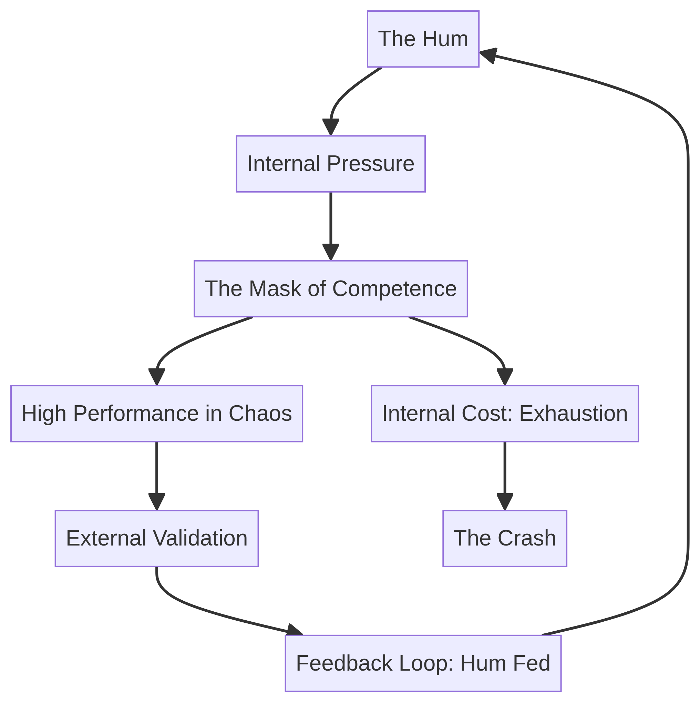
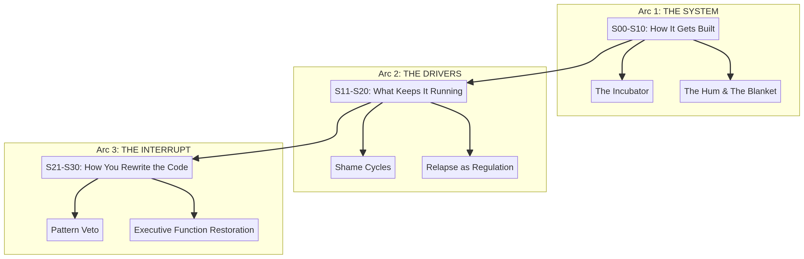

# WRH HIGH-VALUE ASSETS SHOWCASE
## **Deployment Infrastructure — Version 4.0 "Technical Standard"**

---

## **"Empowering Lives, Building Hope, Fostering Recovery"**

---

This page serves as a professional gallery for the core assets of the **What Really Happened (WRH)** Pilot Deployment Package, specifically tailored for our partnership with **Stepping Stones Recovery of Arkansas**.

### **Stepping Stones Leadership Team:**
- **Joseph Cruz**, Founder & Peer Supervisor
- **Tammy Dodson-Hernandez**, Management Professional
- **Jayme Brice**, Recovery Pastor
- **Chrissy Phillips, LMSW**, Therapist
- **Robbie Willis**, Discipleship Pastor
- **Dangie Casper**, Peer Recovery Supervisor
- **Todd Lovell**, Advisory Board Member

---

## **1. THE ONE-CLICK PILOT PROPOSAL**
**The primary outreach tool for Directors and Federal Buyers.**

This self-contained PDF combines the **Stepping Stones Pilot Addendum v1.2**, **Capability Statement**, and **Program Overview** into a single, professionally branded document.

[**DOWNLOAD THE ONE-CLICK PROPOSAL (PDF)**](./assets/One_Click_Pilot_Proposal.pdf)

---

## **2. RENDERED WHITEBOARD BLUEPRINTS**
**Projector-ready visuals for in-room delivery and participant retention.**

### **The Hum & The Blanket**
*Baseline dysregulation map.*

### **The Pattern Veto**
*3-second somatic interruption flowchart.*

### **The Mask**
*High-performance in chaos map.*

### **The Loop**
*The repeating cycle of failure (High Performance → Crash → Disappear → Miss).*

### **Executive Function Arc**
*The 30-session roadmap from "The System" to "The Interrupt."*

---

## **3. FACILITATOR & PARTICIPANT TOOLS**
**Systems-level support for high-intensity environments.**

### **Facilitator Decompression Protocol**
*Systems maintenance for facilitators to manage secondary trauma and cortisol load.*
[**View Protocol**](./checklists/Facilitator_Decompression_Protocol.md)

### **Mobile Plan B View**
*High-contrast, mobile-friendly emergency view for participants in hyperarousal.*
[**View Mobile Card**](./participants/Mobile_Plan_B_View.md)

---

## **4. INSTITUTIONAL TRUST SIGNALS**
**Essential data for federal contracting and SDVOSB status.**

- [**Capability Statement**](./legal/Capability_Statement.md)
- [**Compliance & Trust Signals (NAICS/UEI)**](./legal/Compliance_and_Trust_Signals.md)
- [**Pilot Outcomes & Proof-of-Concept**](./outcomes/Pilot_Outcomes_Proof_of_Concept.md)

---
*Capitol Contracts LLC | Stepping Stones Pilot Deployment | April 2026*
